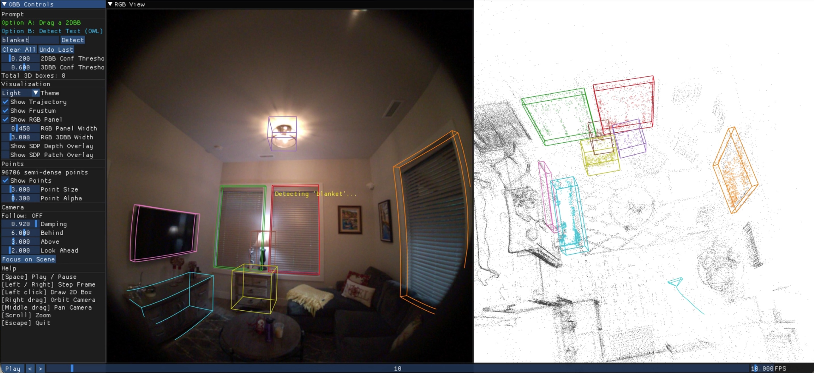

# Overview
Boxer lifts 2D object detections into static, global, fused 3D oriented bounding boxes (OBBs) from posed images and semi-dense point clouds, focused on indoor object detection.

This repo contains the code and pre-trained model needed to run Boxer on a variety of input data sources (inference only code).


In this repo, we provide sample code for running on the following data sources:
* Project Aria Gen 1 & 2
* CA-1M
* SUN-RGBD
* ScanNet (manual download needed)


## Installation

We tested on MacOS (with mps acceleration) and Fedora (with CUDA acceleration).

```bash
# Create conda environment
conda create -n boxer python=3.12
conda activate boxer

# Core dependencies for running Boxer
pip install 'torch>=2.0' numpy opencv-python tqdm  

# To support Project Aria loading
pip install projectaria-tools

# 3D interactive viewer for view_*.py scripts
pip install moderngl moderngl-window imgui[glfw]
```

### Download Model Checkpoints

We host model checkpoints for BoxerNet, DinoV3 and OWLv2 on [HuggingFace](https://huggingface.co/facebook/boxer). Download them to the `ckpts/` directory:

```bash
bash scripts/download_ckpts.sh
```

### Download Aria Data

We host three sample [Project Aria](https://www.projectaria.com/) sequences on [HuggingFace](https://huggingface.co/datasets/facebook/boxer):

```bash
# Download all three sequences (hohen_gen1, nym10_gen1, cook0_gen2)
bash scripts/download_aria_data.sh

# Or download a single sequence
bash scripts/download_aria_data.sh hohen_gen1
```

### Demo #1: Run BoxerNet in headless mode on 10 images
```bash
python run_boxer.py --input nym10_gen1 --max_n=10 --skip_viz
```

### Demo #2: BoxerNet Interactive Demo on Aria Data
This demo allows you to create 2DBB prompts and enter text to prompt OWL to detect objects. Run it like:
```bash
python view_prompt.py --input nym10_gen1
```

You should see a window that looks like this:



### Demo #3: BoxerNet Interactive Demo on Aria Data


### Download Other Data

We provide helper scripts to set up additional data sources:

```bash
# Omni3D SUN-RGBD: extract 20 sample images from your local SUNRGBD data
python scripts/download_omni3d_sample.py

# CA-1M: extract a sample sequence from your local CA-1M data
python scripts/download_ca1m_sample.py

# ScanNet: manually download from https://github.com/scannet/scannet
# then place the scene directory in sample_data/, e.g. sample_data/scene0707_00
```

## Adding Additional Datasets

For the minimal single image lifting with BoxerNet, we require
* image
* intrinsics calibration (we tested with both Pinhole and Fisheye624 camera models)
* the 3D gravity direction
* Depth is optional but improves performance significantly

For lifting a video sequence we need the same as above plus:
* full 6 DoF pose for each image

## Usage

The pipeline supports optional **online 3D tracking** (`--track`) for temporal consistency and **offline 3D fusion** (`--fuse`) for merging detections across frames after all detections have been made.

```bash
# Run on a sample Aria sequence
python run_boxer.py --input hohen_gen1

# Disable visualization (faster, just writes CSV)
python run_boxer.py --input hohen_gen1 --skip_viz

# Custom text prompts
python run_boxer.py --input hohen_gen1 --labels=chair,table,lamp

# Run with online 3D tracking
python run_boxer.py --input hohen_gen1 --track

# Run with post-hoc 3D box fusion
python run_boxer.py --input hohen_gen1 --fuse

# ScanNet sequence
python run_boxer.py --input scene0084_02

# CA-1M sequence
python run_boxer.py --input ca1m-val-42898570

# Omni3D dataset
python run_boxer.py --input SUNRGBD

# Adjust thresholds
python run_boxer.py --input hohen_gen1 --thresh2d 0.3 --thresh3d 0.6

# Use bfloat16 for faster inference on supported GPUs
python run_boxer.py --input hohen_gen1 --precision bfloat16
```

### Outputs

Results are written to `output/<sequence_name>/`:
- `boxer_3dbbs.csv` — per-frame 3D bounding boxes
- `owl_2dbbs.csv` — per-frame 2D detections
- `boxer_3dbbs_tracked.csv` — tracked 3D boxes (with `--track`)
- `boxer_viz_final.mp4` — visualization video

### CLI Reference

| Flag | Default | Description |
|------|---------|-------------|
| `--input` | | Path to input sequence |
| `--detector` | `owl` | 2D detector (`owl`) |
| `--labels` | `lvisplus` | Comma-separated text prompts, or a taxonomy name |
| `--thresh2d` | `0.2` | 2D detection confidence threshold |
| `--thresh3d` | `0.5` | 3D box confidence threshold |
| `--track` | off | Enable online 3D box tracking |
| `--fuse` | off | Run post-hoc 3D box fusion |
| `--skip_viz` | off | Disable visualization (on by default) |
| `--precision` | `float32` | Inference precision (`float32` or `bfloat16`) |
| `--camera` | `rgb` | Aria camera stream (`rgb`, `slaml`, `slamr`) |
| `--pinhole` | off | Rectify fisheye to pinhole |
| `--detector_hw` | `960` | Resize for 2D detector |
| `--ckpt` | see code | Path to BoxerNet checkpoint |
| `--output_dir` | `output/` | Output directory |
| `--gt2d` | off | Use ground-truth 2D boxes as input |
| `--no_sdp` | off | Disable semi-dense point input |
| `--force_cpu` | off | Force CPU inference |

## Project Structure

```
boxer/
├── run_boxer.py              # Main entry point (headless detection + lifting)
├── view_prompt.py            # Interactive demo (2D prompts + OWL text detection)
├── view_fusion.py            # View pre-computed 3D bounding boxes
├── boxernet/
│   ├── boxernet.py           # BoxerNet model (encode → cross-attend → predict)
│   └── dinov3_wrapper.py     # DINOv3 backbone wrapper
├── owl/
│   ├── owl_wrapper.py        # OWLv2 open-vocabulary detector
│   └── clip_tokenizer.py     # CLIP BPE tokenizer + text embedder
├── loaders/
│   ├── base_loader.py        # Base loader interface
│   ├── aria_loader.py        # Project Aria data loader
│   ├── ca_loader.py          # CA-1M dataset loader
│   ├── omni_loader.py        # Omni3D dataset loader
│   └── scannet_loader.py     # ScanNet dataset loader
├── scripts/
│   ├── download_ckpts.sh     # Download model checkpoints
│   ├── download_aria_data.sh # Download sample Aria sequences
│   ├── download_ca1m_sample.py      # Extract CA-1M sample data
│   ├── download_omni3d_sample.py    # Extract Omni3D SUN-RGBD sample
│   └── download_scannet_sample.py   # Download ScanNet sample data
├── tests/                    # Unit tests (see tests/README.md)
└── utils/
    ├── viewer_3d.py          # Interactive 3D visualization + viewer classes
    ├── tw/                   # TensorWrapper types (see utils/tw/README.md)
    │   ├── tensor_wrapper.py # TensorWrapper base class
    │   ├── camera.py         # CameraTW: camera intrinsics + projection
    │   ├── obb.py            # ObbTW tensor wrapper + IoU computation
    │   └── pose.py           # PoseTW: SE(3) poses + quaternion math
    ├── fuse_3d_boxes.py      # 3D box fusion + Hungarian algorithm
    ├── track_3d_boxes.py     # Online 3D bounding box tracker
    ├── file_io.py            # CSV I/O for OBBs and calibration
    ├── image.py              # Image utilities + 3D/2D box rendering
    ├── gravity.py            # Gravity alignment utilities
    ├── taxonomy.py           # Label taxonomy definitions
    ├── demo_utils.py         # Demo helpers, paths, timing
    └── video.py              # Video I/O utilities
```

## FAQ

Q: Can I run it on an arbitrary image without any other info?
A: Theoretically yes, but you would need to estimate the intrinsics and gravity direction. We didn't test that.

Q: Do you plan to release the training or evaluation code?
A: No, we do not, because that would require more long term maintenance from the authors. You can email the first author or leave a github issue if you have any questions about re-implementing these, but our response may be slow.

Q: Does it work on a Windows machine?
A: We did not test it, but running the core model should work.


## Linting

We use [ruff](https://docs.astral.sh/ruff/) for linting and formatting:

```bash
pip install ruff

# Check for lint errors
ruff check .

# Auto-fix lint errors
ruff check --fix .

# Format code
ruff format .
```

## License

The majority of Boxer is licensed under CC-BY-NC. See the [LICENSE](LICENSE) file for details. However portions of the project are available under separate license terms: see [NOTICE](NOTICE).
